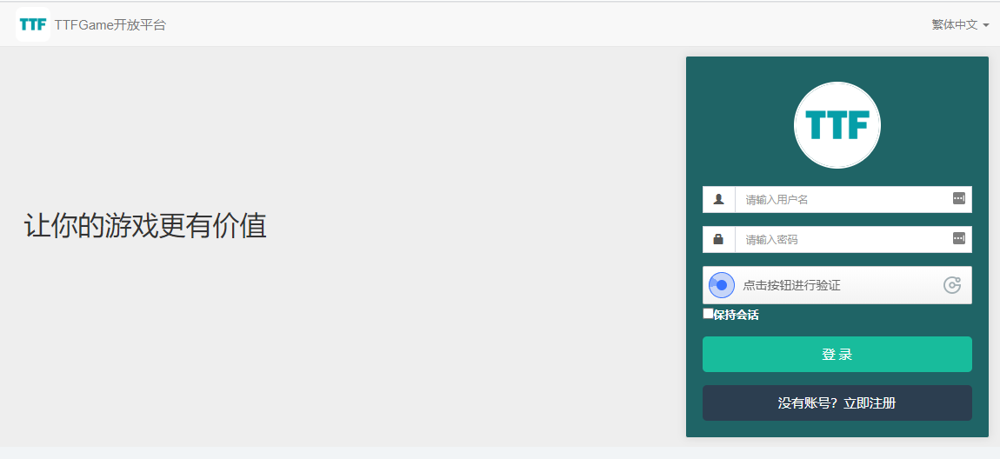

# 1 概述

TTFGame開放平臺是基於TTFGame生態與區塊鏈所打造的開放性遊戲平臺。

> TTFGame生態下有多個基礎平臺支持，當前開放平臺僅針對區塊鏈部分。

   

# 2 平臺準備

通過平臺的[註冊連結](http://ttftest.dashgame.com/admin/index/merchat_register1 ':target=_blank')，或者點擊[平臺首頁](http://ttftest.dashgame.com ':target=_blank')的“沒有帳號？立即註冊”按鈕進入帳號註冊頁面，創建一個開發者帳號。

註冊頁面中，點擊最下方《TTFGame開放平臺協議》可進行閱讀，閱讀結束後若接受協議請點擊單選框打勾，否則無法完成註冊。

錄入基本資訊完成註冊。

註冊帳號結束後，使用註冊時的郵箱和密碼登錄到[平臺首頁](http://ttftest.dashgame.com ':target=_blank')登錄進入後臺。新帳號登錄平臺時，會因為帳號未審核進入控制台頁面時收到提示.

按照提示點擊“立即前往完善資料”即會跳轉至帳號資訊頁面，編輯自己的企業名稱，企業簡介並上傳營業執照。完善資訊後點擊下方的確定按鈕後即發起了審核申請，待管理員確認審核資訊後，會通過發送公告的方式給出相應的審核結果與審核建議，審核未通過時請根據審核建議重新提交審核，審核通過後用戶即可開始正式使用TTFGame平臺。

   

