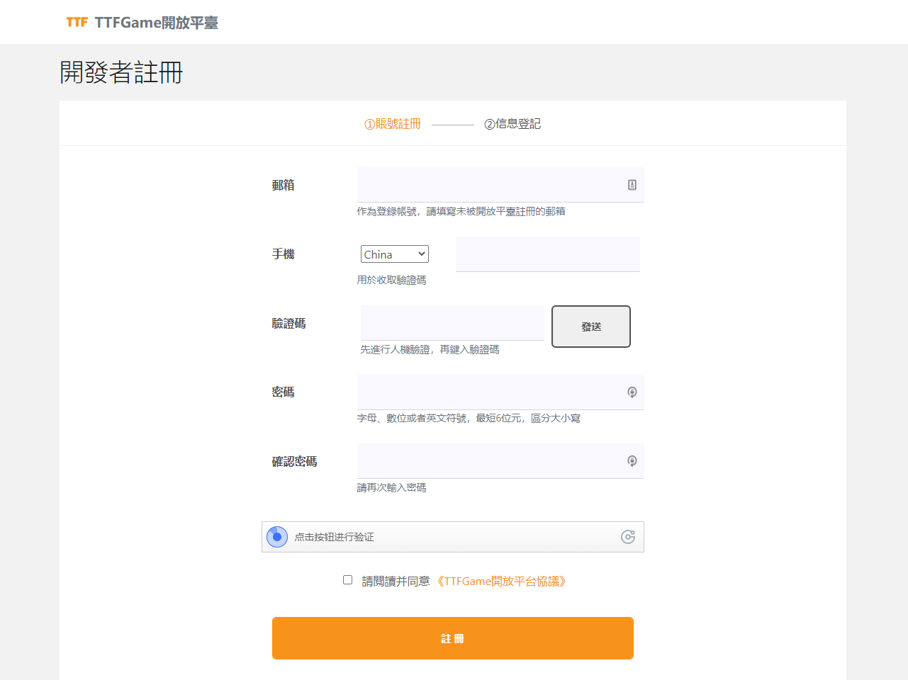
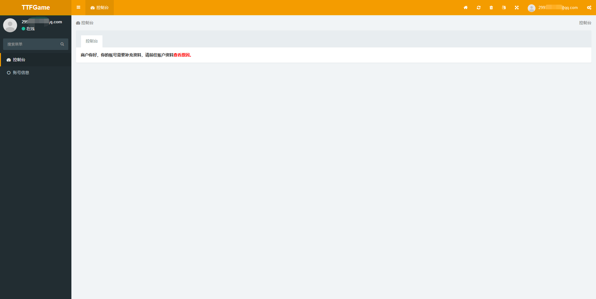
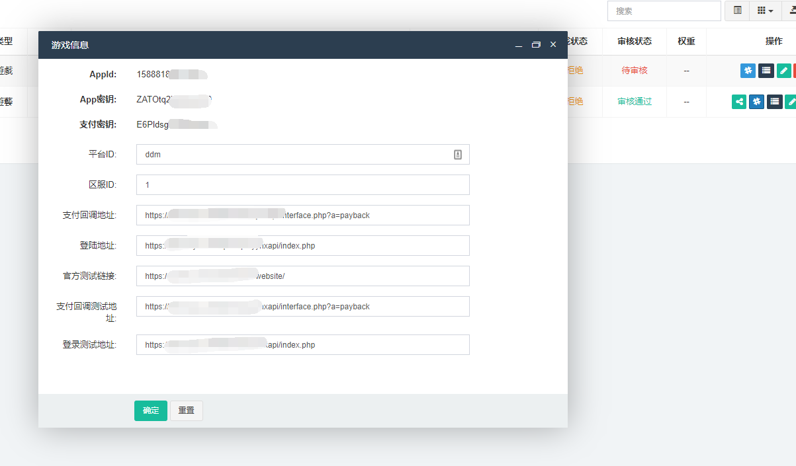

# 1 概述

TTFGame開放平臺是基於TTFGame生態與區塊鏈所打造的開放性遊戲平臺。


> TTFGame生態下有多個基礎平臺支持，當前開放平臺僅針對區塊鏈部分。

  <br />
  <br />

# 2 平臺準備

通過平臺的[註冊連結](http://ttftest.dashgame.com/admin/index/merchat_register1)，創建一個商戶帳號。



錄入基本資訊完成註冊。


登錄用戶進入後臺。



按照提示補充資料，並等待審核。


  <br />

# 3 接入遊戲

## 3.1 自行接入

## 3.1.1 添加測試人員帳號

通過驗證以後，可以通過左側功能表添加測試人員帳號。


其中，手機號和密碼是必填項。

## 3.1.2 創建遊戲

通過驗證以後，可以通過左側功能表創建遊戲。


創建好遊戲以後，需要設置一些必要參數，以便之後接入遊戲。包括：

```
平臺ID
區服ID
支付回檔位址（正式版的服務端支付回檔位址）
登陸位址（正式版的遊戲訪問位址）
官方測試連結（開放平臺測試版的官方連結位址，可與遊戲詳情裡的一致）
支付回檔測試位址（開放平臺測試版的服務端支付回檔位址））
登錄測試位址（開放平臺測試版的遊戲訪問位址）
```


設置完成以後，如果有需要調整的，可點擊編輯按鈕更改。


創建和修改以後，請等待或聯繫平臺管理員進行審核，以便添加和修改的內容生效。


當自行檢測遊戲通過，並經過平臺管理員審核以後，就可以點擊發佈按鈕，發佈遊戲到正式用戶端。


## 3.1.3 下載測試App

遊戲創建並接入完成後，可以通過申請得到的[安卓測試App]()來進行測試。

也可以通過申請得到的[H5版本]()來進行線上測試。

**重要：請使用測試人員帳號登錄，才能看到僅在測試狀態的遊戲。**

<br>

## 3.2 接入遊戲內容開發者

### 3.2.1 邀請內容開發者註冊

進入控制台，分享註冊地址給開發者。


### 3.2.2 審核開發者

查看並確認開發者資訊合格，允許開發者開始接入遊戲。


### 3.2.3 審核遊戲

查看並確認遊戲資訊合格，允許開發者測試並發佈。


  <br />

# 4 自訂用戶端

## 4.1 簡述

開放平臺用戶端由商戶提供基礎資訊，打包屬於自己的版本。

另外，開放平臺的用戶端還支援支援商戶進行部分樣式和文本自訂，但需要按規範提交需求。

用戶端樣式自訂（預約）同時支持三端，更加個性化，以區別于其他商戶的用戶端。

打包需要提供必要資訊，由我們統一重新封包測試並返回。

## 4.2 規範

### 4.2.1 基礎資訊

應用名稱：例如 `ABC玩`。

應用版本：例如 `1.0.0`。

應用圖示：最低512x512圖元。推薦1024x1024圖元。

Splash Screen：寬度、高度小於400圖元，GIF動畫（不迴圈）或PNG序列幀。

【Android】
包名：例如 `com.xyz.abc`。
證書：證書文件，通常以 `.keystore` 或 `.jks` 結尾。
別名：使用的證書別名。
私密金鑰密碼：使用的密碼。

【iOS】
Bundle ID：例如 `com.xyz.abc`。
證書：證書檔（無簽名白包可不用提供）。
Profile：Profile檔（無簽名白包可不用提供）。
私密金鑰密碼：使用的密碼（無簽名白包可不用提供）。

### 4.2.2 當地語系化語言

提供當地語系化語言文檔。（請向您的對接人員索要文檔說明）

根據文檔說明，可以僅提交需要修改的部分。

### 4.2.3 樣式自訂（預約）

#### 4.2.3.1 主題色

主題色將普遍應用於app的標題列、按鈕顏色等，16進制。（例如基礎用戶端可以看到的綠色， `#00875f`）

#### 4.2.3.2 遊戲頁

*待完善*

#### 4.2.3.3 理財頁

*待完善*

#### 4.2.3.4 活動頁

*待完善*

#### 4.2.3.4 個人頁

*待完善*

