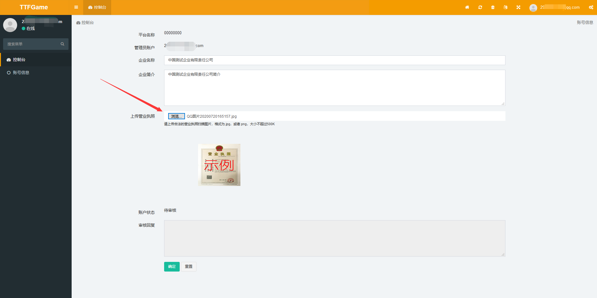

# 1 概述

TTFGame開放平臺是基於TTFGame生態與區塊鏈所打造的開放性遊戲平臺。

> TTFGame生態下有多個基礎平臺支持，當前開放平臺僅針對區塊鏈部分。

   
   

# 2 平臺準備

通過平臺的[註冊連結](http://ttftest.dashgame.com/admin/index/merchat_register1)，創建一個開發者帳號。

錄入基本資訊完成註冊。

登錄用戶進入後臺。

按照提示補充資料，並等待審核。

   
