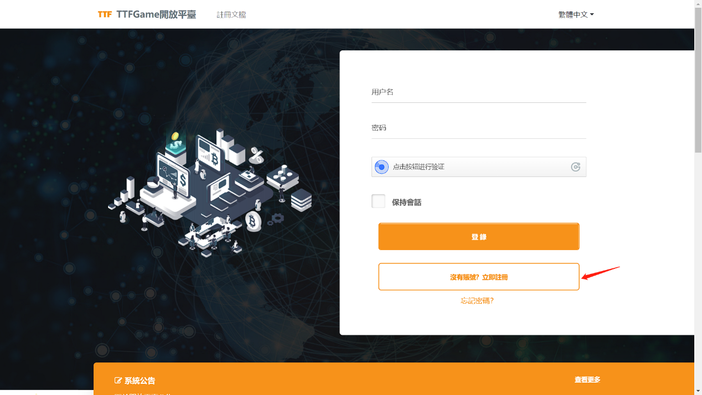
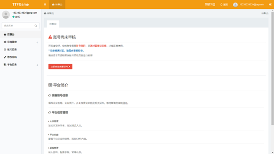
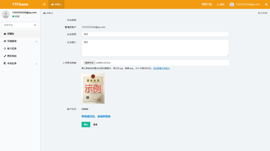

# 1 概述

TTFGame开放平台是基于TTFGame生态与区块链所打造的开放性游戏平台。

> TTFGame生态下有多个基础平台支持，当前开放平台仅针对区块链部分。

   

# 2 平台准备

通过平台的[注册链接](http://ttftest.dashgame.com/admin/index/merchat_register1)，或者点击[平台首页](http://ttftest.dashgame.com)的“没有账号？立即注册”按钮进入账号注册页面，创建一个开发者账号。

注册页面中，点击最下方《TTFGame开放平台协议》可进行阅读，阅读结束后若接受协议请点击单选框打勾，否则无法完成注册。

录入基本信息完成注册。

注册账号结束后，使用注册时的邮箱和密码登录到[平台首页](http://ttftest.dashgame.com)登录进入后台。新账号登录平台时，会因为账号未审核进入控制台页面时收到提示.

按照提示点击“立即前往完善资料”即会跳转至账号信息页面，编辑自己的企业名称，企业简介并上传营业执照。完善信息后点击下方的确定按钮后即发起了审核申请，待管理员确认审核信息后，会通过发送公告的方式给出相应的审核结果与审核建议，审核未通过时请根据审核建议重新提交审核，审核通过后用户即可开始正式使用TTFGame平台。

   

